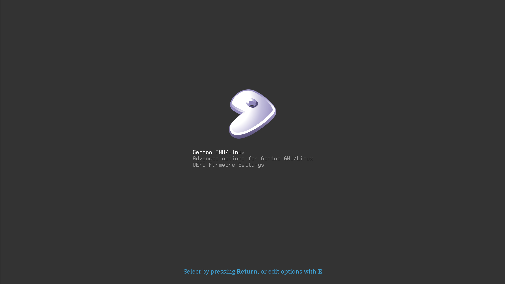

# Gentoo-Silence GRUB2 theme

This theme was forked from Arch-Silence.
Originally made by Filippo Ghibellini, modified by Matteo Salonia.

Preview, 2560x1440 (made with GIMP):


## Font
The font used is Terminus.

The provided config sets the font size to 32 by default,
for displays with a resolution of 2560x1440.

A font size of 12 is also provided, in case you have a smaller display.
Modify `theme/theme.txt`, and set `terminal-font`, `item_font` and
`selected_item_font` to `Terminus 12`.

If the font isn't loaded, make sure you also modify `/etc/default/grub`:

```
GRUB_FONT="/boot/grub/themes/gentoo-silence/terminus32b.pf2"
```

## Custom font
You can also use your own font & font size.
First, convert your font to grub's format:

```
grub-mkfont -s SIZE -o OUT.pf2 /usr/share/fonts/YOUR_FONT
```

Where:
- `SIZE`: font size
- `OUT`: output path (can also just be a filename)
- `YOUR_FONT`: path to your font (most fonts are in `/usr/share/fonts/`)

Then, modify the variables listed above with your font name and size.

## License
If not explicitly stated otherwise all the files in this project are distributed under the [GNU General Public License](./COPYING).

## Authors
Filippo Ghibellini, Matteo Salonia.
